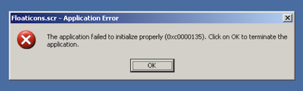

# Floaticons Screensaver

A Windows XP+ screensaver that randomly shows icons floating across the screen.

For example, you may see a Windows 10 logo float across your screen:

## How and Why

This was created specifically with use on Windows XP in mind (WinForms API, not WPF).

It was inspired by a visual gag in [MJD's YouTube videos](https://www.youtube.com/c/MichaelMJD) where logos of software fly across the screen very quickly.

The code is based on [How to develop a screen saver in C#](https://www.codeproject.com/articles/4809/how-to-develop-a-screen-saver-in-c) by Rakesh Rajan (2004).

## Installation

### Supported operating systems

Windows Vista, 7, 8, 8.1, 10 and 11 (may require installing .NET 3.5).

### Supported operating systems (with .NET Framework 2.0 installed)

- Windows 2000 Service Pack 3 
- Windows 2000 Service Pack 4
- Windows XP Service Pack 2

Download the [latest release](https://github.com/conath/FloaticonsScreensaver/releases/latest/) (.src file), then right click in Explorer and choose Install.

If you get a `0xc0000135` error when starting the screensaver, it means you need to install .NET Framework 2.0 (provided with [v1.0.0](https://github.com/conath/FloaticonsScreensaver/releases/tag/v1.0.0)).

## Building

Visual Studio 2017 is the last version to support building for Windows XP.

Follow [these instructions](https://docs.microsoft.com/en-us/cpp/build/configuring-programs-for-windows-xp?view=msvc-170) from Microsoft to configure your Visual Studio.

Then clone this repo and open `ScreenSaver.sln`.

## License

The source code & project files are licensed under the MIT License.

Floaticons app icons are © 2022 Christoph Parstorfer. All rights reserved.

The included third-party logos and icons belong to the respective creators.
